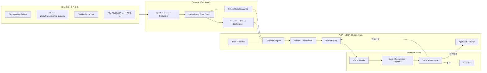
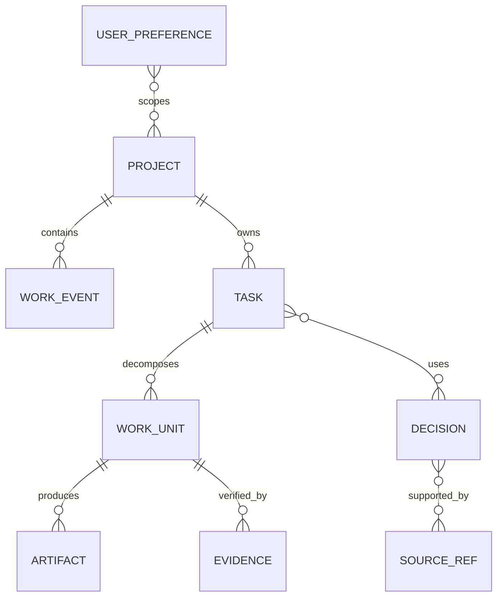

# Office AI Core Architecture v2

## 1. 무엇을 최적화하는가

우선순위는 다음 순서로 고정한다.

1. **업무 맥락 정확도**: 사용자가 지금 무엇을 하고 있고, 왜 그렇게 결정했는지 파악한다.
2. **기대 총비용 최소화**: 가장 싼 호출이 아니라 실패·재시도·검증까지 포함한 총비용을 줄인다.
3. **검증 가능한 자동화**: 완료 조건과 증거가 없는 결과는 완료로 처리하지 않는다.
4. **외부 동작 안전성**: 배포, 전송, 결제, 삭제, 권한 변경은 승인 게이트를 통과한다.
5. **뷰**: 위 네 가지를 관찰하고 통제하는 수단일 뿐 코어가 아니다.

기존 `ai_employee_roadmap`은 JobRunner, 스케줄러, 게임 대시보드가 중심이었다. 새 구조에서는 **Personal Work Graph**, **Context Compiler**, **Model Router**, **Verification Engine**이 코어이고 스케줄러와 UI는 어댑터다.

## 2. 로컬 조사 결과와 설계 반영

현재 확인된 신호:

- Cursor 계획 문서: 12개
- Cursor agent transcript: 주요 프로젝트별 다수의 JSONL
- Cursor 코드 추적: 951개 커밋, 모델별 생성 코드 메타데이터
- 주요 저장소: `gtsn-backend`, `gtsn-admin`, `kiosk`, `screensaver`, `gtsn-app`
- Obsidian: Markdown 1개로 아직 장기기억 원천으로는 부족
- 로컬 추론 환경: RAM 약 64GB, RTX 4060 8GB

따라서 초기 신뢰도 순서는 다음과 같다.

1. Git commit, diff, test 결과
2. Cursor plan의 완료 상태와 결정 사항
3. Cursor transcript의 사용자 지시
4. 저장소 문서와 AGENTS/README
5. Obsidian 메모
6. 파일 수정 시각과 IDE workspace 기록

Obsidian은 자료량이 늘어나면 가장 중요한 “사람이 확인한 장기기억”이 된다. 자동 생성된 요약보다 사용자가 직접 쓴 Markdown에 더 높은 신뢰도를 준다.

## 3. 전체 구조




## 4. AI를 어떻게 나누는가

“에이전트 수가 많을수록 좋다”는 전제를 버린다. 에이전트 간 대화는 토큰을 중복 소비하고 오류를 전파한다. 기본은 **한 작업 단위에 한 실행기**이며 다음 조건에서만 역할을 분리한다.

- 서로 독립적인 작업을 병렬화할 수 있음
- 실행기와 검증기를 분리해야 편향을 줄일 수 있음
- 서로 다른 도구 권한이 필요함
- 컨텍스트가 너무 커서 전문 영역별 분리가 유리함

### 고정 역할이 아닌 런타임 역할


| 역할              | 호출 조건           | 책임                            |
| --------------- | --------------- | ----------------------------- |
| Intake          | 모든 명령, 규칙 우선    | 카테고리·프로젝트·위험도 결정              |
| Context Curator | 모든 비단순 작업       | 필요한 로컬 근거만 Context Pack으로 컴파일 |
| Planner         | 3단계 이상 또는 복합 업무 | 완료 기준과 Work DAG 작성            |
| Specialist      | 작업별             | 기획, 개발, PM, 리서치, 운영 실행        |
| Verifier        | 산출물 존재 시        | 테스트·스키마·원문·정책 검증              |
| Skeptic         | 고위험/모호한 판단      | 반례와 누락 탐색                     |
| Reporter        | 모든 완료 업무        | 결정·증거·비용·잔여 위험만 보고            |


단순 분류나 파일 변환은 Intake와 Specialist를 하나의 저비용 호출로 합친다. 고위험 개발 작업은 Planner, Developer, Verifier를 분리한다.

## 5. Personal Work Graph

### 원본을 복사하지 않고 참조한다

원본 파일과 transcript 전체를 프롬프트에 넣지 않는다. 로컬 인덱스에는 다음만 저장한다.

- 콘텐츠 해시
- 원본 위치와 줄/커밋 참조
- 시각과 프로젝트
- 요약된 작업 이벤트
- 태그와 엔터티
- 신뢰도와 민감도

`.env`, private key, 토큰, 이메일 등의 패턴은 인덱싱 전에 제거한다. 대용량 Cursor `state.vscdb`는 9GB 이상이고 포맷이 비공개·가변적이므로 직접 의존하지 않는다. 공개적인 workspace JSON, plan Markdown, transcript JSONL, Git CLI를 우선 사용한다.

### 핵심 엔터티




- `WorkEvent`: commit, 계획, 사용자 지시, 문서 변경
- `ProjectState`: 현재 목표, 진행 중 작업, 최근 결정, 알려진 위험
- `Decision`: 선택, 근거, 대안, 유효 기간
- `Task`: 목표, 완료 조건, 위험, 비용 예산
- `Artifact`: 코드, 문서, 보고서
- `Evidence`: 테스트, 원문 인용, diff, 승인
- `UserPreference`: 코딩/보고/승인 방식

### Current Focus Resolver

장기 업무량과 현재 업무를 분리한다. “지금 하는 일”은 최근 72시간만 대상으로 아래 신호를 사용한다.


| 신호                         | 기본 가중치 | 이유                 |
| -------------------------- | ------ | ------------------ |
| Git working tree/현재 branch | 1.2    | 실제 수정 중인 범위        |
| Cursor 사용자 지시              | 1.0    | 현재 의도              |
| 최근 commit                  | 0.9    | 완료된 실제 변경          |
| Cursor plan                | 0.65   | 계획은 실행보다 약한 신호     |
| Workspace open 기록          | 0.5    | 열어둔 것과 작업 중인 것은 다름 |


12시간 반감기로 최근성을 계산한다. 사용자가 명령에서 프로젝트를 명시하면 이 추론보다 항상 우선한다. 상위 후보 점수가 비슷하면 자동으로 하나를 고르지 않고 프로젝트를 명시하도록 요청한다.

## 6. Context Compiler

토큰 절감의 핵심은 모델 선택보다 먼저 **보낼 컨텍스트를 줄이는 것**이다.

### 2단계 검색

1. 결정론적 필터: 프로젝트, 기간, 파일 유형, 카테고리, 권한
2. 하이브리드 순위: 키워드 + 임베딩 + 최근성 + 신뢰도 + 사용 빈도

### 점수 예시

```text
score =
  0.35 * semantic_similarity +
  0.25 * lexical_match +
  0.15 * project_match +
  0.10 * recency +
  0.10 * source_confidence +
  0.05 * prior_usefulness
```

현재 MVP는 외부 임베딩 호출 없이 키워드·최근성·신뢰도·소스 가중치로 동작한다. 이후 로컬 임베딩을 추가해도 데이터 계약은 바뀌지 않는다.

### Context Pack

모델에는 다음 구조만 전달한다.

```json
{
  "objective": "이번 작업의 목표",
  "constraints": ["변경 금지 영역", "승인 조건"],
  "current_state": ["현재 상태 요약"],
  "relevant_decisions": ["결정 + source_ref"],
  "related_work": ["커밋/계획 + source_ref"],
  "acceptance_criteria": ["기계 판정 가능한 완료 조건"],
  "token_budget": 12000
}
```

각 항목에는 source hash가 붙는다. 오래된 결정과 최신 코드가 충돌하면 최신 코드가 자동 우선되는 것이 아니라 충돌 이벤트를 생성해 검증 대상으로 보낸다.

## 7. 모델 라우터

모델 이름을 업무 규칙에 직접 넣지 않는다. `ModelProfile`에 비용, 지연, 로컬 여부, 추론·코딩·도구·검증 역량을 등록한다.

### 목적 함수

```text
expected_total_cost =
  call_cost
  + P(failure) * (retry_cost + escalation_cost + wasted_time)
  + risk_penalty
  + latency_penalty
```

무료 로컬 모델도 실패해서 사람이 검토하거나 클라우드 모델을 다시 호출하면 비용이 0이 아니다.

### 권장 라우팅 정책


| 작업        | 1차           | 검증           | 상향 조건     |
| --------- | ------------ | ------------ | --------- |
| 분류·추출·포맷  | 규칙 → 로컬 8B   | JSON Schema  | 1회 실패     |
| 짧은 요약     | 로컬 8B 또는 경제형 | 원문 coverage  | 근거 누락     |
| 일반 기획 초안  | 경제형          | 표준형 또는 규칙    | 반례·충돌     |
| 일반 개발     | 표준형          | 테스트·lint     | 테스트 실패 2회 |
| 복합 설계     | 표준형          | 프리미엄 skeptic | 고위험/모호성   |
| 최종 고위험 판단 | 프리미엄         | 별도 검증 + 사람   | 자동 승인 금지  |


로컬 8B는 개인정보 포함 문서의 분류·요약, 검색어 확장, 태깅에 적합하다. RTX 4060 8GB에서는 대형 추론 모델을 코어 실행기로 기대하지 않고 전처리/압축 계층으로 쓴다.

### 프롬프트 캐시

- 시스템 규칙과 도구 계약은 고정 prefix로 유지
- 작업 데이터는 뒤에 배치
- 전체 transcript 대신 Context Pack 사용
- 동일 source hash의 요약, 임베딩, 검사 결과 재사용
- 모델별 tokenizer로 호출 직전 실제 토큰을 재계산

## 8. 업무 자동화

### 명령형 자동화

사용자가 “KCP 관련 최근 작업을 기준으로 다음 구현을 진행해줘”라고 지시하면:

1. `development` + `gtsn-backend/admin`으로 분류
2. 관련 Cursor plan, 최근 commit, transcript 사용자 지시 검색
3. 기존 완료/미완료와 변경 금지 영역 추출
4. Work DAG와 완료 기준 생성
5. 각 Work Unit을 모델 라우터에 전달
6. 코드 변경 후 lint/typecheck/test/diff scope 검증
7. push/deploy는 승인 대기
8. 결정, 변경, 증거, 비용을 보고

### 이벤트형 자동화

초기에는 읽기 전용 자동화만 활성화한다.

- 매일 아침: 최근 commit/plan/todo를 기반으로 브리핑
- 작업 종료: 이번 세션 결정·미완료·다음 행동 기록
- PR 생성 전: 계획 대비 diff 누락과 테스트 확인
- 문서 drift: 코드와 오래된 Markdown 충돌 탐지
- 반복 실패: 같은 종류의 오류를 모아 자동화 후보 제안

메시지 발송, 배포, DB 쓰기, 결제, 삭제는 기본적으로 자동화하지 않는다.

## 9. 검증 엔진

검증 순서는 싼 것부터 비싼 것으로 고정한다.

1. 스키마/타입/필수 필드
2. 파일 범위와 정책
3. lint/typecheck/unit/integration/E2E
4. 원문 citation과 claim coverage
5. 실행기와 다른 프롬프트/모델의 반례 탐색
6. 사람 승인

최종 상태는 `done`이 아니라 다음 중 하나다.

- `verified`: 모든 완료 기준과 증거 존재
- `needs_approval`: 검증됐지만 외부 동작 승인 필요
- `needs_revision`: 수정 가능한 실패
- `blocked`: 외부 입력 없이는 진행 불가
- `failed`: 재시도 예산 소진

## 10. 저장과 보안

### 로컬 우선

- 원본 자료: 기존 위치 유지
- 로컬 인덱스: `.officeai/`
- 1차 저장: JSONL로 계약 검증
- 2차 저장: SQLite + FTS5
- 선택 저장: 로컬 embedding vector index

### Cloud 전송 정책

- `restricted`: 로컬 모델만
- `internal`: redaction + source 최소화 후 허용
- `public`: 정책 범위 내 허용

모델 요청 로그에는 원문 대신 source hash, 모델 ID, 토큰, 비용, 검증 결과를 기록한다. API 키와 원문 프롬프트는 로그에 남기지 않는다.

## 11. 구현 경계

```text
core/
  scanner/        로컬 소스 → WorkEvent
  security/       secret redaction, sensitivity
  context/        검색, ranking, Context Pack
  routing/        capability registry, expected-cost route
  planning/       Task → Work DAG
  execution/      worker/tool adapters
  verification/   deterministic and model checks
  approvals/      side-effect policy
  telemetry/      token/cost/outcome ledger
adapters/
  cursor/
  git/
  obsidian/
  filesystem/
  llm/
  tools/
ui/
```

현재 저장소의 `core/` MVP는 scanner, redaction, Context Pack, model routing을 실제 실행할 수 있다.

## 12. 단계별 로드맵

### Phase 0 — 완료

- 로컬 소스 조사
- 읽기 전용 scanner
- secret redaction
- WorkEvent 계약
- Context Pack 예산
- 기대 총비용 model router

### Phase 1 — 개인 업무 메모리

- SQLite/FTS5 저장
- project alias와 entity resolution
- 세션 종료 시 ProjectState snapshot
- Obsidian `Decisions/`, `Projects/`, `Daily/` 규칙

### Phase 2 — 개발 업무 자동화

- 저장소별 AGENTS/명령 자동 탐지
- 계획 생성과 diff scope
- lint/typecheck/test verifier
- patch 생성까지만 자동, push는 승인

### Phase 3 — 기획/PM 자동화

- 기획서/회의록/결정 로그 템플릿
- todo와 dependency graph
- 브리핑과 리스크 보고

### Phase 4 — 정책 학습

- 작업별 성공률, 재시도, 비용 기록
- 실제 데이터로 model profile 보정
- 사용자가 수정한 보고서를 preference로 반영
- 고정 임계값을 평가 데이터 기반으로 조정

## 13. 성공 지표

- 업무 시작 전 컨텍스트 수집 시간
- Context Pack 토큰 / 원본 추정 토큰 비율
- 작업당 총 모델 비용
- 첫 시도 검증 통과율
- 상향 라우팅 비율
- 근거 없는 claim 수
- 사용자 수정량
- 승인 후 외부 동작 실패율
- 자동화로 절감한 실제 시간

모델 비용 절감률만 단독 KPI로 사용하면 낮은 품질의 반복 호출을 유도한다. **검증된 작업 1건당 총비용**이 핵심 KPI다.